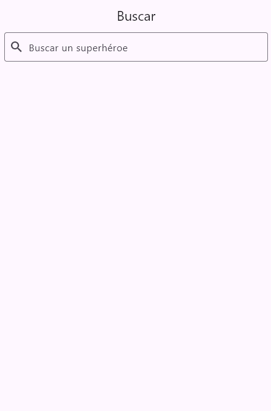
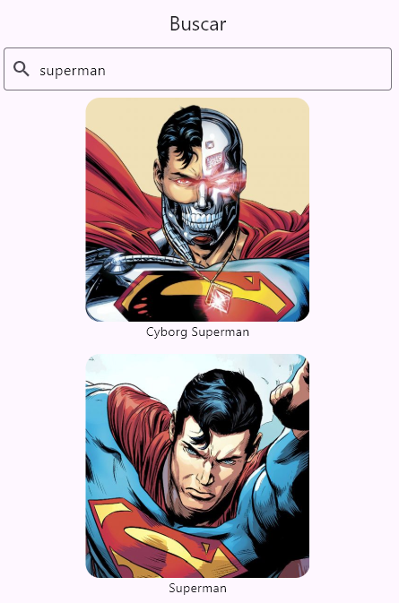
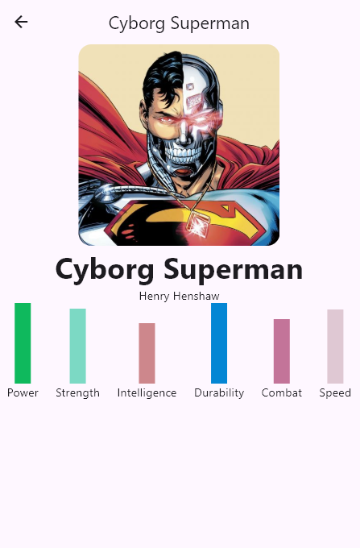

# 
Superhero app

$${Hecho \space con \space \color{blue}Flutter}$$

Aplicación que obtiene y muestra información de un superhéroe

*****
## <g>DEV</g>
* Obtener **Access Token** de [superheroapi](https://superheroapi.com/)
* Cambiar el nombre de `.env.template` a `.env`
* Copiar el Access Token en el `.env > SUPERHEROAPI`

*****
## <pu>Stack</pu>
* Flutter

*****
## Imágenes

  
  
  

*****
## <pu>Dependecias usadas</pu>
* get
* flutter_dotenv
* http